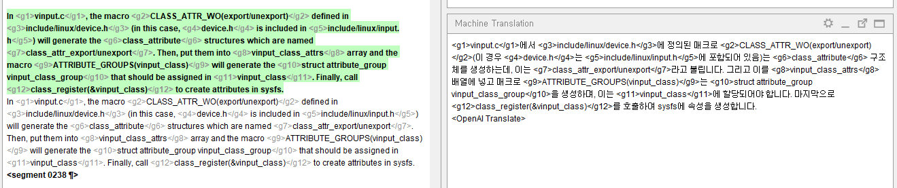
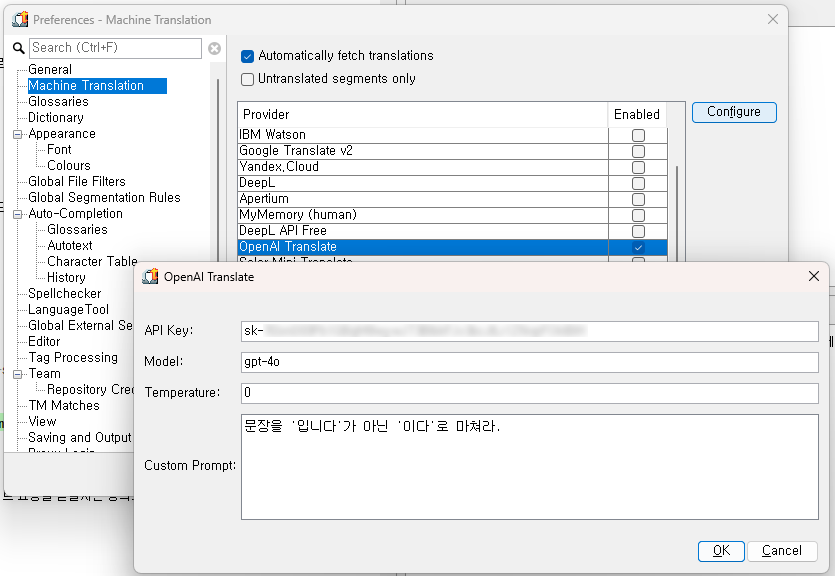
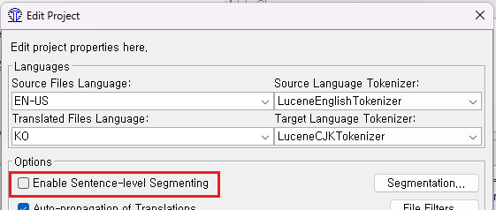

# OpenAI Plug-in for OmegaT

This plug-in enables users to utilize the OpenAI API for machine translation within the OmegaT CAT environment.

Originally based on the [Naver Papago plug-in for OmegaT](https://github.com/ParanScreen/omegat-plugin-navertranslate), this plug-in has evolved significantly.

This software is open source software licensed under the GNU GPLv2. In addition, as a special exception, the copyright holders of this program give you permission to combine the program with free software programs or libraries that are released with code included in the standard release of [JSON-java Library](https://github.com/stleary/JSON-java) under the [JSON-java License](https://github.com/stleary/JSON-java/blob/master/LICENSE). You may copy and distribute such a system following the terms of the GNU GPL for this program and the licenses of the other code concerned. For detailed information, please refer to the LICENSE file.

## Key Features

- **Machine Translation with OpenAI**: Use the OpenAI API to translate text within OmegaT.
- **Glossary Integration**: Automatically incorporates glossary terms into translations to improve accuracy.
- **Tag Preservation**: Ensures that tags are preserved during the translation process, maintaining the structure and formatting of the original text.
- **Built-in Caching**: Leverages OmegaT's built-in caching mechanism to improve translation request handling and efficiency.
- **Configurable Model and Temperature via GUI**: Users can now configure the OpenAI model and temperature settings directly through the OmegaT GUI.
- **Custom User-Defined Prompts via GUI**: Easily add custom instructions into the translation prompt through the settings UI, allowing for greater flexibility and control over translation output.

## How to Use

### 1. Install the Plug-in

1. Download the plug-in file.
2. Copy the plug-in file to the appropriate directory based on your operating system:

    - **Windows**: Copy the plug-in file into `%SystemDrive%%ProgramFiles%\OmegaT\plugins` directory.
    - **macOS**: Copy the plug-in file into `/Applications/OmegaT.app/Contents/Java/plugins` directory.
    - **GNU/Linux**: Copy the plug-in file under the directory where OmegaT is installed.

### 2. Configure API Key and Settings via the OmegaT UI

1. **Open the Preferences Window**:
    - Open OmegaT.
    - Go to `Options > Preferences`.

2. **Navigate to Machine Translation**:
    - In the Preferences window, select `Machine Translation` from the left-hand menu.

3. **Select OpenAI Translate**:
    - In the list of available machine translation services, click on `OpenAI Translate` or `OpenAI Translate (API Key Required)`.

4. **Configure the Plug-in**:
    - Click on the "Configure" button to open the configuration window.
    - In the configuration window, enter your OpenAI API key in the "API Key" field.
    - Specify the desired OpenAI model (e.g., `gpt-4o-mini`) and temperature setting. The default model is `gpt-4o`, and the default temperature is `0`.
    - If you have specific instructions or a style you want the translation to follow, enter this in the "Custom Prompt" field.
      - Example: `Please translate with a formal tone and prioritize technical accuracy.`

5. **Save Settings**:
    - After entering your settings, click "OK" to save your preferences. These settings will be stored and automatically applied each time you use the OpenAI translation service within OmegaT.

### 3. Start Translating

1. Open your project in OmegaT.
2. Use the OpenAI translation service by selecting it from the `Options > Machine Translation` menu.
3. If desired, you may want to uncheck "Enable Sentence-level Segmenting" in the Options menu to achieve more fluent translations.

